# FineTune Architecture

## High-Level Component Diagram

```mermaid
flowchart TB
  subgraph AppEntry["App Entry (AppKit Lifecycle)"]
    FineTuneApp["FineTuneApp.swift\n(@main + AppDelegate)"]
    MenuBarStatusController["MenuBarStatusController\n(NSStatusItem + KeyablePanel)"]
    CrashGuard["CrashGuard\n(signal handler + C buffer)"]
    OrphanedTapCleanup["OrphanedTapCleanup\n(startup device scan)"]
  end

  subgraph ViewModel["ViewModel"]
    MenuBarPopupViewModel["MenuBarPopupViewModel\n(@Observable @MainActor)\nEQ expansion, animation,\ndevice sorting, app activation"]
  end

  subgraph UI["UI (SwiftUI)"]
    MenuBarPopupView["MenuBarPopupView\n(@Bindable viewModel)"]

    subgraph Rows["Row Views"]
      DeviceRow["DeviceRow"]
      InputDeviceRow["InputDeviceRow"]
      AppRowWithLevelPolling["AppRowWithLevelPolling\n(timer-based VU polling)"]
      AppRow["AppRow"]
      InactiveAppRow["InactiveAppRow\n(pinned, dimmed)"]
      AppRowEQToggle["AppRowEQToggle\n(animated slider↔X)"]
    end

    subgraph Components["Shared Components"]
      DevicePicker["DevicePicker\n(limited on macOS 26)"]
      DeviceIconView["DeviceIconView\n(NSImage + SF Symbol fallback)"]
      EQPanelView["EQPanelView"]
      EQSliderView["EQSliderView"]
      EQPresetPicker["EQPresetPicker"]
      VUMeter["VUMeter\n(8-bar level meter)"]
      LiquidGlassSlider["LiquidGlassSlider"]
      MuteButton["MuteButton"]
      EditablePercentage["EditablePercentage\n(inline % editor)"]
      SliderAutoUnmute["SliderAutoUnmute\n(ViewModifier)"]
      DropdownMenu["DropdownMenu"]
    end

    subgraph SettingsUI["Settings UI"]
      SettingsView["SettingsView\n(General, Audio,\nNotifications, Data)"]
      SettingsToggleRow["SettingsToggleRow"]
      SettingsSliderRow["SettingsSliderRow"]
      SettingsButtonRow["SettingsButtonRow"]
      SettingsIconPickerRow["SettingsIconPickerRow"]
      SettingsUpdateRow["SettingsUpdateRow"]
      SoundEffectsDeviceRow["SoundEffectsDeviceRow"]
    end

    subgraph DesignSystem["Design System"]
      DesignTokens["DesignTokens\n(colors, typography, spacing,\ndimensions, animations)"]
    end
  end

  subgraph State["State & Orchestration"]
    AudioEngine["AudioEngine\n(@Observable @MainActor)\nPermission confirmation,\ncoreaudiod restart handler,\ntap health checks (3s),\npause-state hysteresis,\nrecreation suppression"]
    DeviceVolumeMonitor["DeviceVolumeMonitor\n(@Observable @MainActor)\nDebounced listeners,\nvolume/mute/default tracking,\nsystem sounds device"]
    VolumeState["VolumeState\n(per-app & per-device persistence)"]
    SettingsManager["SettingsManager\n(JSON persistence,\ndebounced saves,\nschema versioning)"]
    UpdateManager["UpdateManager\n(Sparkle auto-updates)"]
  end

  subgraph Monitors["Monitors"]
    AudioProcessMonitor["AudioProcessMonitor\n(running audio apps,\nXPC → parent mapping)"]
    AudioDeviceMonitor["AudioDeviceMonitor\n(output devices + icons,\nO(1) UID/ID caches,\ncoreaudiod restart callback)"]
    MediaNotificationMonitor["MediaNotificationMonitor\n(Spotify/Apple Music\ninstant play/pause)"]
  end

  subgraph Routing["Audio Routing (Real-Time)"]
    ProcessTapController["ProcessTapController\n(per-app audio tap,\ncrossfade state machine,\nlock-free atomic state)"]
    TapResources["TapResources\n(CoreAudio object lifecycle)"]
    TapDiagnostics["TapDiagnostics\n(19-field RT-safe snapshot)"]
    EQProcessor["EQProcessor\n(10-band biquad EQ)"]
    AudioFormatConverter["AudioFormatConverter"]
    CrossfadeState["CrossfadeState\n(lock-free state machine)"]
  end

  subgraph DSP["Audio Processing"]
    AudioBufferProcessor["AudioBufferProcessor"]
    GainProcessor["GainProcessor"]
    VolumeRamper["VolumeRamper"]
    SoftLimiter["SoftLimiter"]
    BiquadMath["BiquadMath"]
  end

  subgraph Models["Models"]
    AudioApp["AudioApp"]
    DisplayableApp["DisplayableApp\n(active | pinnedInactive)"]
    AudioDevice["AudioDevice"]
    EQSettings["EQSettings\n(10 bands, ±12dB)"]
    EQPreset["EQPreset"]
    VolumeMapping["VolumeMapping\n(linear gain ↔ log slider)"]
  end

  subgraph CoreAudioTypes["CoreAudio Utilities"]
    CoreAudioQueues["CoreAudioQueues\n(shared listener queue)"]
    AudioScope["AudioScope"]
    TransportType["TransportType"]
    TapFormat["TapFormat"]
    Extensions["AudioDeviceID + AudioObjectID\nextensions (8 files)"]
  end

  subgraph CoreAudio["macOS Audio Services"]
    CoreAudioHAL["CoreAudio HAL"]
    AudioToolbox["AudioToolbox"]
    DefaultOutput["Default Output Device"]
    OutputDevices["Output Devices"]
  end

  subgraph Persistence["Persistence"]
    SettingsFiles["Settings/*.json\n(~/Library/Application Support/FineTune/)"]
  end

  subgraph Utilities["Utilities"]
    DeviceIconCache["DeviceIconCache"]
    SingleInstanceGuard["SingleInstanceGuard"]
    URLHandler["URLHandler\n(finetune:// scheme)"]
  end

  %% App Entry Flow
  FineTuneApp -->|"1. destroyOrphanedDevices()"| OrphanedTapCleanup
  FineTuneApp -->|"2. CrashGuard.install()"| CrashGuard
  FineTuneApp -->|"3. creates"| SettingsManager
  FineTuneApp -->|"4. creates"| AudioEngine
  FineTuneApp -->|"5. creates"| MenuBarStatusController
  FineTuneApp -->|"URL open events"| URLHandler
  MenuBarStatusController -->|creates| MenuBarPopupViewModel
  MenuBarStatusController -->|hosts in KeyablePanel| MenuBarPopupView

  %% ViewModel Bindings
  MenuBarPopupViewModel --> AudioEngine
  MenuBarPopupViewModel --> DeviceVolumeMonitor
  MenuBarPopupView -->|"@Bindable viewModel"| MenuBarPopupViewModel

  %% UI → State
  AppRow -->|volume/mute/device| AudioEngine
  DeviceRow -->|volume/mute/default| DeviceVolumeMonitor
  InputDeviceRow -->|volume/mute/default| DeviceVolumeMonitor
  DevicePicker -->|select device| AudioEngine
  EQPanelView -->|EQ settings| AudioEngine
  VUMeter -->|polls levels| AudioEngine
  AppRowEQToggle -->|toggleEQ| MenuBarPopupViewModel
  SettingsView -->|app settings| SettingsManager
  SettingsUpdateRow -->|check updates| UpdateManager

  %% UI Composition
  MenuBarPopupView --> DeviceRow
  MenuBarPopupView --> InputDeviceRow
  MenuBarPopupView --> AppRowWithLevelPolling
  MenuBarPopupView --> InactiveAppRow
  MenuBarPopupView --> SettingsView
  AppRowWithLevelPolling --> AppRow
  AppRow --> AppRowEQToggle
  AppRow --> MuteButton
  AppRow --> LiquidGlassSlider
  AppRow --> VUMeter
  AppRow --> DevicePicker
  AppRow --> EQPanelView
  AppRow --> EditablePercentage
  DeviceRow --> DeviceIconView
  DevicePicker --> DeviceIconView
  AppRow -.->|uses| SliderAutoUnmute
  DeviceRow -.->|uses| SliderAutoUnmute

  %% AudioEngine → Subsystems
  AudioEngine --> AudioProcessMonitor
  AudioEngine --> AudioDeviceMonitor
  AudioEngine --> DeviceVolumeMonitor
  AudioEngine --> MediaNotificationMonitor
  AudioEngine --> VolumeState
  AudioEngine --> SettingsManager
  AudioEngine -->|"create per-app taps\n(1 per audio process)"| ProcessTapController

  %% Crash Safety
  ProcessTapController -->|"trackDevice()"| CrashGuard
  OrphanedTapCleanup -->|"scan FineTune-* devices"| CoreAudioHAL

  %% Monitors → CoreAudio
  AudioProcessMonitor -->|process list| CoreAudioHAL
  AudioDeviceMonitor -->|"device list\n+ service restart"| CoreAudioHAL
  DeviceVolumeMonitor -->|default/volume/mute| AudioToolbox
  DeviceVolumeMonitor -->|default device UID| CoreAudioHAL
  DeviceVolumeMonitor --> DefaultOutput
  DefaultOutput --> OutputDevices

  %% Audio Routing → CoreAudio
  ProcessTapController -->|process tap| CoreAudioHAL
  ProcessTapController -->|aggregate devices| CoreAudioHAL
  ProcessTapController --> TapResources
  ProcessTapController --> TapDiagnostics
  ProcessTapController --> EQProcessor
  ProcessTapController --> AudioFormatConverter
  ProcessTapController --> CrossfadeState
  ProcessTapController --> OutputDevices

  %% DSP
  EQProcessor --> BiquadMath
  ProcessTapController --> GainProcessor
  ProcessTapController --> VolumeRamper
  ProcessTapController --> SoftLimiter

  %% CoreAudio Utilities
  AudioDeviceMonitor --> Extensions
  DeviceVolumeMonitor --> CoreAudioQueues
  AudioProcessMonitor --> CoreAudioQueues
  Extensions --> CoreAudioHAL

  %% Persistence
  SettingsManager --> SettingsFiles
  VolumeState --> SettingsFiles

  %% URL Handler
  URLHandler --> AudioEngine
  URLHandler --> SettingsManager

  CoreAudioHAL --- AudioToolbox
```



## Data Flow Summary

```
User interaction → SwiftUI Views → MenuBarPopupViewModel / AudioEngine
                                          ↓
                                   ProcessTapController (1 per app)
                                          ↓
                            CoreAudio HAL (process tap + aggregate device)
                                          ↓
                               Real-time audio callback
                                          ↓
                    AudioFormatConverter → GainProcessor → EQProcessor → SoftLimiter
                                          ↓
                                    Output Device
```

## Key Architectural Patterns

### App Lifecycle (AppKit, not SwiftUI Scene)
`FineTuneApp` uses `@NSApplicationDelegateAdaptor(AppDelegate)`. The `AppDelegate.applicationDidFinishLaunching` runs a 5-step startup sequence:
1. `OrphanedTapCleanup.destroyOrphanedDevices()` — scan and destroy leftover aggregate devices from previous crashes
2. `CrashGuard.install()` — install signal handlers (SIGABRT, SIGSEGV, SIGBUS, SIGTRAP) with a fixed C buffer tracking aggregate device IDs
3. Create `SettingsManager` (loads JSON from `~/Library/Application Support/FineTune/settings.json`)
4. Create `AudioEngine` with injected SettingsManager
5. `SingleInstanceGuard` check, notification authorization, create `MenuBarStatusController`

`MenuBarStatusController` owns an `NSStatusItem` with a `KeyablePanel` (non-activating panel that can become key). Left-click toggles the popup; right-click shows a context menu. Detects macOS 26 button action/target resets and re-wires automatically via a 2-second timer.

POSIX signal handlers (SIGTERM, SIGINT) trigger clean `stopSync()` then `exit()`. `applicationWillTerminate` flushes settings and stops the audio engine.

### ViewModel Layer
`MenuBarPopupViewModel` (`@Observable @MainActor`) owns EQ expansion state (`expandedEQAppID`), animation debounce, popup visibility tracking (pauses VU polling when hidden), device sorting logic, and app activation (via AppleScript). `MenuBarPopupView` binds to it via `@Bindable`.

### Per-App Audio Taps
`AudioEngine` maintains a `[pid_t: ProcessTapController]` dictionary — one tap per audio-producing process. Each `ProcessTapController` manages its own CoreAudio process tap, aggregate device, format converter, and crossfade state machine for seamless device switching.

On macOS 26+, taps use `CATapDescription.bundleIDs` for bundle-ID targeting (required because Chromium-based browsers route audio through renderer subprocesses that PID-based taps can't see). `isProcessRestoreEnabled` is intentionally NOT set — it causes dead aggregate output where the IOProc writes to valid buffers but audio never reaches hardware. See `docs/known_issues/bundle-id-tap-silent-output-macos26.md` for the investigation.

### Permission Confirmation
On first launch, taps start with `.unmuted` (safe if app dies during permission grant). Once real input audio is detected (`inputHasData > 0` or `lastInputPeak > 0.0001`), taps are upgraded to `.mutedWhenTapped` via `recreateAllTaps()`. This prevents the audio-mute-on-permission-grant bug. The `permissionConfirmed` flag is per-session (not persisted), requiring re-granting on each launch.

### Crossfade Device Switching
> **macOS 26:** Per-app device routing has known limitations — single non-default routing and dual simultaneous output work, but 3+ simultaneous devices have shown issues. See `docs/known_issues/macos26-audio-routing-investigation.md`.

`CrossfadeState` implements a lock-free state machine for glitch-free device switching. Primary and secondary taps overlap during transition, with equal-power crossfade. Bluetooth devices get longer warmup (500ms vs 50ms standard). The full sequence:
1. **Snapshot** current routing (in-memory + persisted)
2. **Enter recreation suppression** mode (block notification callbacks)
3. **Create secondary tap** on new device with warmup phase
4. **Crossfade** (50ms default) from primary to secondary
5. **Destroy primary tap** after secondary confirmed
6. **Restore routing** from snapshot to undo spurious notifications
7. **Exit suppression** with grace period

### Real-Time Safety
`ProcessTapController` uses `nonisolated(unsafe)` atomic properties for all state accessed from the audio callback thread: volume, mute, peak levels, EQ parameters, diagnostic counters. No locks, no allocations on the RT path. Uses vDSP (SIMD-optimized Accelerate) for buffer operations.

### Tap Health & Diagnostics
`AudioEngine` runs a 3-second health check timer. `TapDiagnostics` captures 19 RT-safe counters per tap (callback counts, silence flags, converter stats, peak levels, format info). Health checks detect both stalled taps (callbacks stopped) and broken taps (callbacks running but input disconnected). Broken taps are auto-recreated.

### coreaudiod Restart Recovery
`AudioEngine` listens for `kAudioHardwarePropertyServiceRestarted`. On daemon restart, it destroys all stale taps, waits 1.5s for stabilization, then recreates all taps via `applyPersistedSettings()`.

### Startup Routing Policy
Startup routing for apps with custom settings is controlled by `AppSettings.startupRoutingPolicy`:
- `preserveExplicitRouting` (default): if a persisted per-app device is available, reuse it. If unavailable, use startup default as runtime fallback without overwriting the saved explicit choice. If no explicit route exists, use startup default and persist it.
- `followSystemDefault`: route to the current startup default device and persist that routing.

Startup default selection still validates against non-virtual output devices; if the system default is virtual/filtered, it falls back to the first real output device.

### Crash Safety (Multi-Layer)
Three layers protect against orphaned aggregate devices that silently mute apps:
1. **CrashGuard** — C-compatible signal handler tracking up to 64 aggregate device IDs in a fixed buffer. On SIGABRT/SIGSEGV/SIGBUS/SIGTRAP, destroys all tracked devices via CoreAudio IPC before re-raising the signal. Uses only async-signal-safe operations.
2. **OrphanedTapCleanup** — startup scan of all CoreAudio devices for "FineTune-*" names, destroying any found. Handles `kill -9` scenarios where CrashGuard cannot run.
3. **POSIX signal handlers** — SIGTERM/SIGINT trigger graceful `stopSync()` for normal shutdown paths.

### Pause-State Detection with Asymmetric Hysteresis
AudioEngine detects app pause/play state using two mechanisms:
- **Fast path**: `MediaNotificationMonitor` listens for distributed notifications from Spotify (`com.spotify.client`) and Apple Music (`com.apple.Music`) for near-zero-latency state changes.
- **Slow path**: VU-level detection for other apps (browsers, VLC, etc.) with ~0.5–1.5s lag.
- **Hysteresis**: 1.5s to detect pause (prevents false positives during brief silence), 0.05s to detect play (instant responsiveness).

### URL Scheme (finetune://)
`URLHandler` (`@MainActor`) processes `finetune://` URLs for external automation:
- `set-volumes` — set app volumes (0–200%)
- `step-volume` — adjust volume by 5% increments
- `set-mute` / `toggle-mute` — mute control
- `set-device` — route app to specific device
- `reset` — reset apps to 100% volume

Settings are persisted for inactive apps, taking effect when they next produce audio.

### Pinned Apps
Apps can be "pinned" so they remain visible in the UI even when not actively producing audio. `DisplayableApp` is an enum with `.active(AudioApp)` and `.pinnedInactive(PinnedAppInfo)` cases, providing a unified interface for the view layer. `InactiveAppRow` renders these with dimmed appearance (0.6 opacity) and a filled star indicator.

### Settings & Persistence
`SettingsManager` persists to `~/Library/Application Support/FineTune/settings.json` with debounced saves and schema version migrations. Persisted data includes:
- Per-app: volumes, device routing, mute states, EQ settings, device selection mode, pinned status
- App-wide: launch at login, menu bar icon style, default volume, max boost, input device lock, persistence toggles (remember volume/mute, remember EQ), startup routing policy, notification preferences
- System: sounds device routing (follow default vs. explicit)

### Auto-Updates
`UpdateManager` wraps Sparkle's `SPUStandardUpdaterController` as an `ObservableObject`. Exposes `canCheckForUpdates` and `checkForUpdates()` for the Settings UI. Supports automatic background checks.

### Design System
`DesignTokens` centralizes all magic numbers: 13 color categories, 6 typography styles, 7 spacing values, 15 dimension groups, scroll thresholds, animation curves, and timing constants.

### Shared Utilities
- `SliderAutoUnmute` — ViewModifier replacing duplicated auto-unmute-on-drag in AppRow/DeviceRow
- `DeviceIconView` — NSImage display with SF Symbol fallback, used by DeviceRow/DevicePicker
- `EditablePercentage` — Inline clickable percentage display with edit mode and click-outside dismissal
- `CoreAudioQueues` — shared `DispatchQueue` factory for CoreAudio listener callbacks
- `AudioObjectID+Listener` — add/remove listener factory used by 3 monitors
- `DeviceIconCache` — caches `AudioDeviceID → NSImage` to avoid repeated CoreAudio calls

## SPM Target Structure

```
Package.swift (Swift Tools 6.0, macOS 14.2+)
├── FineTuneCore              Audio processing library (isolated, no app dependencies)
│   ├── BiquadMath, CrossfadeState
│   ├── AudioBufferProcessor, VolumeRamper, GainProcessor, SoftLimiter
│   └── EQPreset, EQSettings, VolumeMapping
├── FineTuneIntegration       Main app logic (depends on FineTuneCore, exclude-based target)
│   ├── AudioEngine, ProcessTapController, monitors
│   ├── SettingsManager, VolumeState
│   └── CoreAudio extensions and types
├── FineTuneCoreTests         Unit tests for audio processing (11 files)
└── FineTuneIntegrationTests  Integration tests for engine/routing (9 files)

External SPM package:
  Sparkle (auto-update framework)

System frameworks:
  AudioToolbox, AVFoundation, Accelerate, AppKit, SwiftUI,
  Foundation, UserNotifications, ServiceManagement, os, Combine
```

## Settings JSON Schema

```json
{
  "version": 5,
  "appVolumes": { "bundleID": 1.0 },
  "appDeviceRouting": { "bundleID": "deviceUID" },
  "appMutes": { "bundleID": false },
  "appEQSettings": { "bundleID": { "bandGains": [...], "isEnabled": true } },
  "appSettings": {
    "launchAtLogin": false,
    "menuBarIconStyle": "default",
    "defaultNewAppVolume": 1.0,
    "maxVolumeBoost": 2.0,
    "lockInputDevice": true,
    "rememberVolumeMute": true,
    "rememberEQ": true,
    "startupRoutingPolicy": "preserveExplicitRouting",
    "showDeviceDisconnectAlerts": true
  },
  "systemSoundsFollowsDefault": true,
  "appDeviceSelectionMode": { "bundleID": "single" },
  "appSelectedDeviceUIDs": { "bundleID": ["uid1", "uid2"] },
  "lockedInputDeviceUID": null,
  "pinnedApps": ["bundleID1", "bundleID2"],
  "pinnedAppInfo": { "bundleID": { "name": "...", "icon": "..." } }
}
```

## App Configuration

**Info.plist:**
- `LSUIElement: true` — menu bar app, no dock icon
- `LSMultipleInstancesProhibited: true` — enforced via SingleInstanceGuard
- `NSAudioCaptureUsageDescription` — permission prompt for process taps
- `CFBundleURLTypes` — registers `finetune://` URL scheme

**Entitlements:**
- `com.apple.security.app-sandbox: true`
- `com.apple.security.device.audio-input: true` — required for process taps
- `com.apple.security.files.user-selected.read-write: true`

## File Layout

```
FineTune/
├── FineTuneApp.swift                          App entry + AppDelegate + signal handlers
├── FineTune.entitlements
├── Info.plist, Info-Debug.plist
├── Assets.xcassets/
├── Audio/
│   ├── AudioEngine.swift                      Main orchestrator
│   ├── AudioDeviceMonitor.swift               Device discovery + O(1) caches
│   ├── AudioProcessMonitor.swift              App audio detection + XPC mapping
│   ├── DeviceVolumeMonitor.swift              Volume/mute/default tracking
│   ├── ProcessTapController.swift             Per-app audio tap
│   ├── EQProcessor.swift                      10-band EQ (vDSP_biquad)
│   ├── BiquadMath.swift                       Biquad filter coefficients
│   ├── CrashGuard.swift                       Signal handler + C buffer cleanup
│   ├── OrphanedTapCleanup.swift               Startup orphan device scan
│   ├── MediaNotificationMonitor.swift         Spotify/Music instant play/pause
│   ├── SystemSoundsDeviceChanges.swift        System sounds routing guide
│   ├── TapAPITestRunner.swift                 CoreAudio tap API validation
│   ├── Crossfade/
│   │   └── CrossfadeState.swift               Lock-free crossfade FSM
│   ├── Processing/
│   │   ├── AudioBufferProcessor.swift         RT-safe buffer ops (vDSP)
│   │   ├── AudioFormatConverter.swift         Sample format conversion
│   │   ├── GainProcessor.swift                SIMD gain application
│   │   ├── SoftLimiter.swift                  Peak limiting
│   │   └── VolumeRamper.swift                 Click-free volume ramp
│   ├── Tap/
│   │   ├── TapDiagnostics.swift               RT-safe diagnostic snapshot
│   │   └── TapResources.swift                 CoreAudio resource lifecycle
│   ├── Types/
│   │   ├── AudioScope.swift
│   │   ├── CoreAudioQueues.swift              Shared listener queue
│   │   ├── TapFormat.swift
│   │   └── TransportType.swift
│   └── Extensions/                            CoreAudio property access (9 files)
│       ├── AudioDeviceID+Classification.swift
│       ├── AudioDeviceID+Info.swift
│       ├── AudioDeviceID+Resolution.swift
│       ├── AudioDeviceID+Streams.swift
│       ├── AudioDeviceID+Volume.swift
│       ├── AudioObjectID+Listener.swift
│       ├── AudioObjectID+Properties.swift
│       └── AudioObjectID+System.swift
├── Models/
│   ├── AudioApp.swift
│   ├── AudioDevice.swift
│   ├── DisplayableApp.swift                   Union: active | pinnedInactive
│   ├── EQPreset.swift
│   ├── EQSettings.swift
│   ├── VolumeMapping.swift
│   └── VolumeState.swift
├── Settings/
│   ├── SettingsManager.swift                  JSON persistence + schema versioning
│   └── UpdateManager.swift                    Sparkle auto-update wrapper
├── Utilities/
│   ├── DeviceIconCache.swift
│   ├── SingleInstanceGuard.swift
│   └── URLHandler.swift                       finetune:// URL scheme
└── Views/
    ├── MenuBarPopupView.swift                 Main popup UI
    ├── MenuBarPopupViewModel.swift            Presentation logic
    ├── DevicePickerView.swift                 Output/Input device tabs
    ├── EQPanelView.swift                      Per-app EQ panel
    ├── EQSliderView.swift                     Single EQ band slider
    ├── MenuBar/
    │   └── MenuBarStatusController.swift      NSStatusItem + panel lifecycle
    ├── Rows/
    │   ├── AppRow.swift                       Active app control row + AppRowWithLevelPolling (inline)
    │   ├── AppRowEQToggle.swift               Animated EQ toggle button
    │   ├── DeviceRow.swift                    Output device row
    │   ├── InputDeviceRow.swift               Input device row
    │   └── InactiveAppRow.swift               Pinned inactive app row
    ├── Components/
    │   ├── DeviceIconView.swift               Shared icon component
    │   ├── DevicePicker.swift
    │   ├── DropdownMenu.swift
    │   ├── EQPresetPicker.swift
    │   ├── EditablePercentage.swift           Inline percentage editor
    │   ├── ExpandableGlassRow.swift
    │   ├── LiquidGlassSlider.swift
    │   ├── MouseInsideModifier.swift
    │   ├── MuteButton.swift
    │   ├── PopoverHost.swift
    │   ├── RadioButton.swift
    │   ├── SectionHeader.swift
    │   ├── SliderAutoUnmute.swift             Auto-unmute ViewModifier
    │   └── VUMeter.swift
    ├── Settings/
    │   ├── SettingsView.swift                 Main settings panel
    │   ├── SettingsButtonRow.swift
    │   ├── SettingsIconPickerRow.swift         Menu bar icon selector
    │   ├── SettingsRowView.swift              Base settings row
    │   ├── SettingsSliderRow.swift
    │   ├── SettingsToggleRow.swift
    │   ├── SettingsUpdateRow.swift             Sparkle update check UI
    │   └── SoundEffectsDeviceRow.swift         System sounds routing
    ├── DesignSystem/
    │   ├── DesignTokens.swift                 Centralized design tokens
    │   ├── ViewModifiers.swift
    │   └── VisualEffectBackground.swift
    └── Previews/
        ├── MockData.swift
        └── PreviewContainer.swift

testing/tests/                                 ~287 tests across 20 files
├── AudioBufferTestHelpers.swift               Shared test helpers
├── IntegrationTestHelpers.swift
├── AppRowInteractionTests.swift               UI interaction tests
├── AudioEngineCharacterizationTests.swift     Characterization tests
├── ProcessTapControllerTests.swift            Characterization tests
├── AudioEngineRoutingTests.swift              Integration tests
├── AudioSwitchingTests.swift
├── DefaultDeviceBehaviorTests.swift
├── StartupAudioInterruptionTests.swift
├── SingleInstanceGuardTests.swift
├── BiquadMathTests.swift                      Unit tests
├── CrossfadeStateTests.swift
├── EQPresetTests.swift
├── EQSettingsTests.swift
├── GainProcessorTests.swift
├── AudioBufferProcessorTests.swift
├── SoftLimiterTests.swift
├── VolumeMappingTests.swift
├── VolumeRamperTests.swift
└── TapDiagnosticPatternTests.swift         Diagnostic pattern tests
```

## View Hierarchy

```
FineTuneApp (@main)
│
└─ MenuBarStatusController (NSStatusItem + KeyablePanel)
   │
   └─ MenuBarPopupView (SwiftUI root, @Bindable viewModel)
      │
      ├─ [Settings Open?]
      │  └─ SettingsView
      │     ├─ GeneralSection
      │     │  ├─ SettingsToggleRow (Launch at Login)
      │     │  ├─ SettingsIconPickerRow (Menu Bar Icon)
      │     │  └─ SettingsUpdateRow (Check for Updates)
      │     ├─ AudioSection
      │     │  ├─ SettingsSliderRow (Default Volume)
      │     │  ├─ SettingsSliderRow (Max Volume Boost)
      │     │  ├─ SettingsToggleRow (Lock Input Device)
      │     │  ├─ SettingsToggleRow (Remember Volume & Mute)
      │     │  └─ SettingsToggleRow (Remember EQ)
      │     ├─ NotificationsSection
      │     │  └─ SettingsToggleRow (Device Disconnect Alerts)
      │     └─ DataSection
      │        ├─ SoundEffectsDeviceRow
      │        └─ SettingsButtonRow (Reset All Settings)
      │
      └─ [Main Content View]
         ├─ Device Tabs (Output / Input)
         │  ├─ DeviceRow[] (output devices, scrollable)
         │  ├─ InputDeviceRow[] (input devices)
         │  └─ Default device indicator
         │
         ├─ App List (scrollable)
         │  ├─ AppRowWithLevelPolling → AppRow (active apps)
         │  │  ├─ App icon + name
         │  │  ├─ VUMeter (real-time level)
         │  │  ├─ LiquidGlassSlider (volume)
         │  │  ├─ EditablePercentage (direct % entry)
         │  │  ├─ MuteButton
         │  │  ├─ DevicePicker (device dropdown)
         │  │  ├─ AppRowEQToggle
         │  │  └─ [EQ Expanded?]
         │  │     └─ EQPanelView
         │  │        ├─ EQSliderView[] (10 bands)
         │  │        ├─ EQPresetPicker
         │  │        └─ Enable/Disable toggle
         │  │
         │  └─ InactiveAppRow[] (pinned, dimmed, 0.6 opacity)
         │
         └─ Settings Button (gear/X morphing animation)
```
